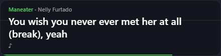
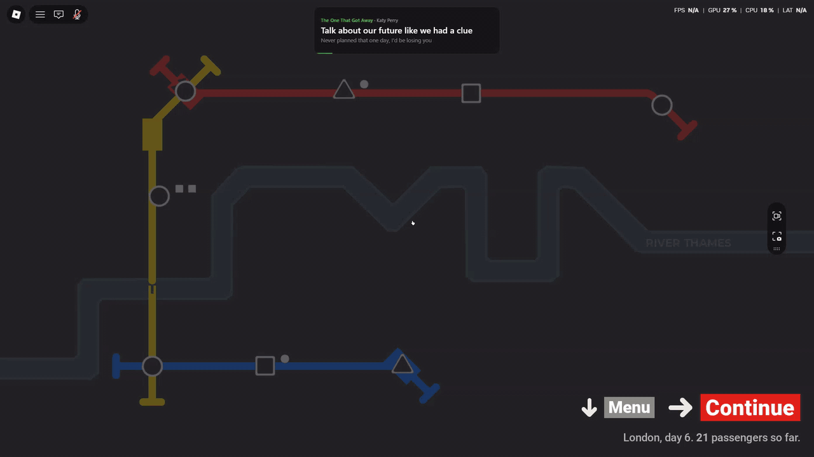

# Lyrics Overlay

**A small, always-on-top synced lyrics overlay for Windows. Built to stay out of the way while you play games.**

It shows the current lyric line and a dimmed preview of the next one in a compact, click-through box. No Spotify login, no API keys, no tokens.

> **Forked from [Nicolas-Arias3142/Spotify_Lyrics_Overlay](https://github.com/Nicolas-Arias3142/Spotify_Lyrics_Overlay).** Thanks to the original author for the idea and the starting point. See [What changed](#what-changed) below.

[Preview](#preview) · [Download](#download) · [Using it](#using-it) · [Troubleshooting](#troubleshooting) · [Build from source](#build-from-source) · [Credits](#credits)

---

## Preview

<p align="center">
  
</p>

It stays small and out of the way while you play:

<p align="center">
  
</p>

---

## Download

1. Go to the **[latest release](https://github.com/heyxferdi/Spotify_Lyrics_Overlay/releases/latest)**.
2. Download one of the two files:
   - **`Lyrics Overlay Setup x.x.x.exe`**: installs the app and adds a Start Menu shortcut.
   - **`Lyrics Overlay x.x.x.exe`**: portable version, runs without installing.
3. Start it, then play music.

You don't need Node.js, Git or a Spotify developer account.

**Windows SmartScreen warning:** because the app isn't code-signed, Windows may show "Windows protected your PC" the first time. Click **More info → Run anyway**. Some antivirus programs can also be cautious about unsigned apps. The source code is all in this repository if you want to check or build it yourself.

## Using it

Play a song in the **Spotify desktop app** (or Spotify in your browser). The overlay appears at the bottom center of your screen and shows the title, artist, the current lyric line and the next line. A thin line along the bottom edge shows song progress. It fades when the music is paused and disappears when nothing is playing.

The overlay ignores mouse clicks, so it never gets in the way of your game. To change how it looks, **right-click its icon in the system tray** (bottom-right of the taskbar, possibly under the `^` arrow):

| Option | What it does |
|---|---|
| **Position** | Top or bottom, left, center or right |
| **Size** | Small, Medium or Large |
| **Opacity** | 100%, 75%, 50% or 30% |
| **Unlock to drag** | Lets you drag the box to a custom spot. Turn it off again to make it click-through |
| **Start with Windows** | Launches the overlay when you log in (installed version) |
| **Quit** | Closes the overlay |

Your choices are remembered between runs.

## Troubleshooting

- **The overlay doesn't show in my game.** It only appears over games in *windowed* or *borderless windowed* mode. In exclusive fullscreen, Windows draws the game above everything. Switch the game's display mode.
- **"No synced lyrics for this song".** Lyrics come from [LRCLIB](https://lrclib.net), a free community database. Popular songs are usually covered, but some tracks (especially obscure ones) have no synced lyrics there.
- **Nothing appears at all.** Make sure a song is actually playing and that Windows is showing it in its media controls (the volume pop-up shows the song name). Also check that the overlay isn't sitting under the game's own HUD, and try a different **Position**.
- **Lyrics are slightly early or late.** The sync data comes from LRCLIB and can differ a little between versions of a song.
- **Windows only.** The app reads "now playing" information from Windows itself, so it doesn't run on macOS or Linux.

## What changed

The original project showed lyrics by calling Spotify's web API with a login and a bearer token you had to copy from your browser every hour. Spotify has since closed off that approach for most people, so this fork was reworked:

- **No Spotify API, login or token.** The song title, artist and position now come from the Windows media session (the same info shown in the Windows volume pop-up), read through a small PowerShell script.
- **Lyrics from [LRCLIB](https://lrclib.net)** instead of Spotify's private lyrics endpoint.
- **A compact UI** meant for gaming: two lines of text, a progress line, and tray options for position, size and opacity.
- **A Windows installer**, so nobody needs a terminal.

Trade-offs: album art is no longer shown, and lyric coverage depends on LRCLIB.

## Build from source

Requires [Node.js](https://nodejs.org) on Windows.

```bash
git clone https://github.com/heyxferdi/Spotify_Lyrics_Overlay.git
cd Spotify_Lyrics_Overlay
npm install
```

Run in development:

```bash
npm run start
```

Build the installer and portable `.exe` (output goes to the `release` folder):

```bash
npm run dist
```

No `.env` file is needed. The dev server uses port 3000 by default. To change it, create a `.env` file containing `VITE_PORT=<port>`.

If `npm run dist` fails with a "cannot create symbolic link" error, enable Developer Mode in Windows (Settings → System → For developers) or run the terminal as Administrator, then try again.

## Credits

- Original project: [Nicolas-Arias3142/Spotify_Lyrics_Overlay](https://github.com/Nicolas-Arias3142/Spotify_Lyrics_Overlay) (MIT)
- Lyrics: [LRCLIB](https://lrclib.net)
- Built with [Electron](https://www.electronjs.org), [React](https://react.dev) and [Vite](https://vite.dev)

This project isn't affiliated with or endorsed by Spotify.

## License

[MIT](LICENSE). The original copyright notice is kept, as the license requires.
